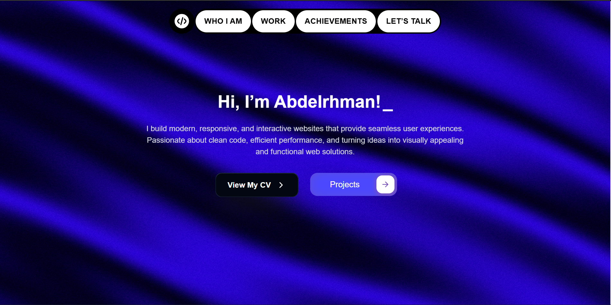
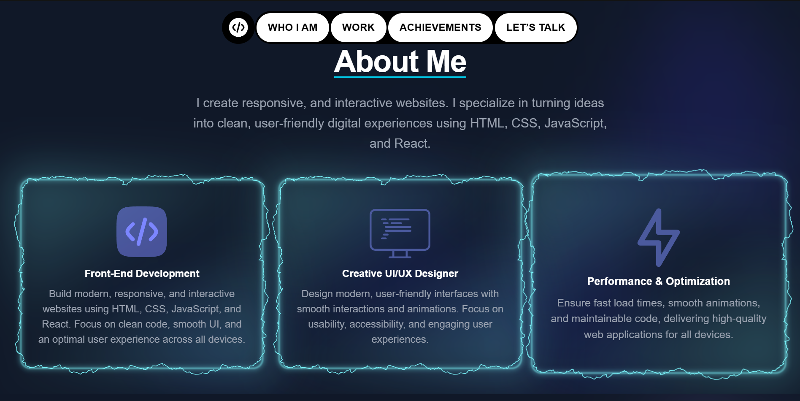
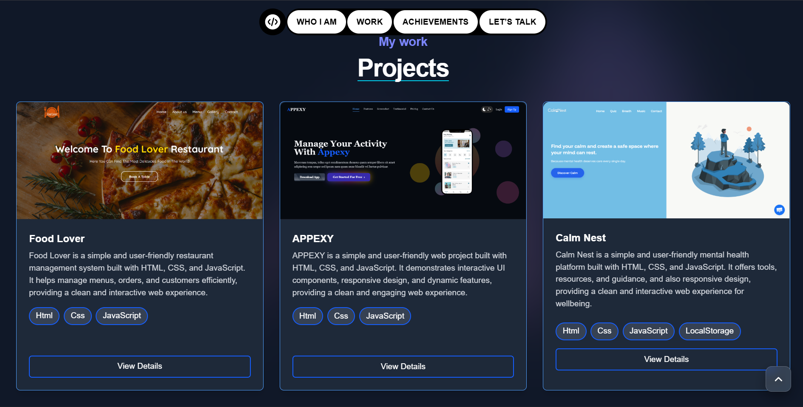
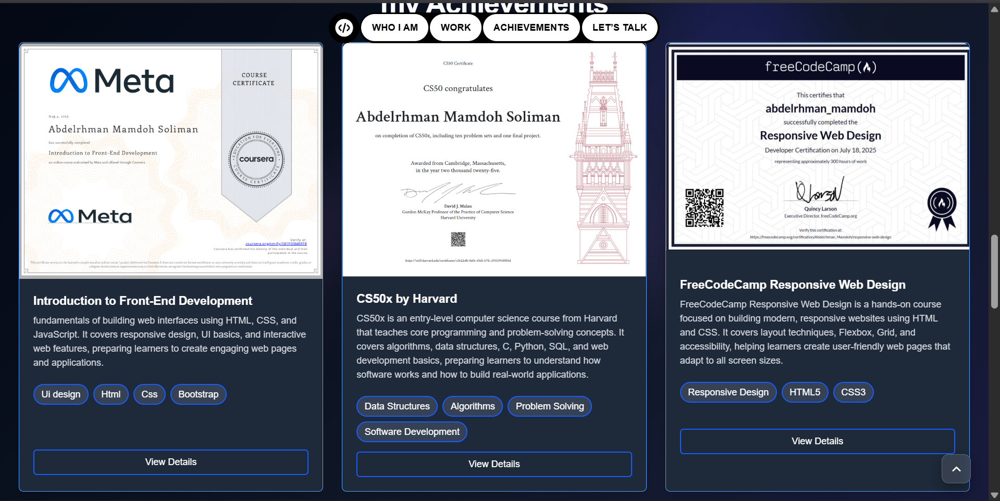
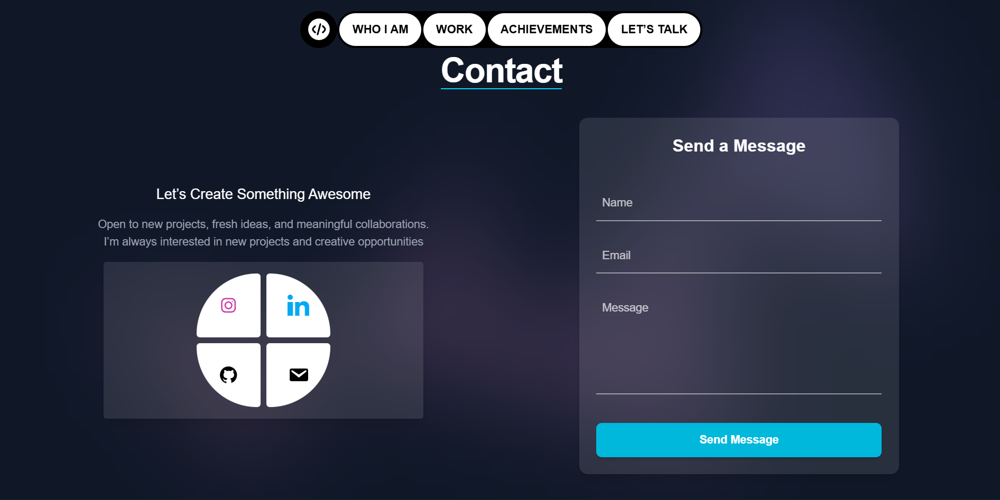

# Abdelrhman Mamdoh - Modern Developer Portfolio

A high-performance, visually stunning, and fully responsive developer portfolio built with a focus on modern web aesthetics and user experience. This project showcases a premium dark-mode design with glassmorphism, smooth animations, and advanced form handling.

---

## 📑 Table of Contents
- [Technologies Used](#-technologies-used)
- [Key Features](#-key-features)
- [Screenshots](#-screenshots)
- [Live Demo](#-live-demo)
- [Installation / Setup Instructions](#-installation--setup-instructions)
- [Deployment](#-deployment)
- [Code Structure](#-code-structure)
- [Challenges & Solutions](#-challenges--solutions)
- [Credits](#-credits)

---

## 🛠️ Technologies Used
- **Frontend Framework**: [React 18](https://reactjs.org/)
- **Build Tool**: [Vite](https://vitejs.dev/)
- **Styling**: [Tailwind CSS](https://tailwindcss.com/)
- **Animations**: [GSAP (GreenSock Animation Platform)](https://greensock.com/gsap/)
- **Form Handling**: [@formspree/react](https://formspree.io/)
- **Code Logic**: Javascript (ES6+)
- **UI Animations**: React Bits

---

## ✨ Key Features
- **Premium UI/UX**: Dark mode aesthetic with glassmorphism effects and custom cyan glow highlights.
- **GSAP Animations**: Smooth, high-performance animations including a smart "Back-to-Top" button.
- **Advanced Form Validation**: Custom client-side validation logic with real-time feedback (validate-on-blur) and visual error/success indicators.
- **Direct API Integration**: Fully functional contact form powered by **Formspree**, handling message submissions without a backend.
- **Smooth Anchor Scrolling**: Custom navigation system with smooth scrolling to sections for a seamless single-page experience.
- **Fully Responsive**: Optimized for all screen sizes (Mobile, Tablet, Desktop) using Tailwind's layout engine.

---

##  Screenshots
### Portfolio Overview

*The main landing page featuring a modern, dark-themed hero section.*

### About me 


### Projects 


### certficats 



### Contact 


---


## 🔗 Live Demo
Check out the live project here: [Click Here](https://abdelrhman005.github.io/Abdelrhman-portfolio/)

---

##  Installation / Setup Instructions

### Prerequisites
- [Node.js](https://nodejs.org/) (v16+ recommended)
- npm or yarn

### Steps to Run Locally
1. **Clone the repository**:
   ```bash
   git clone https://github.com/abdelrhman005/Abdelrhman-portfolio.git
   ```
2. **Navigate to the project directory**:
   ```bash
   cd Abdelrhman-portfolio
   ```
3. **Install dependencies**:
   ```bash
   npm install
   ```
4. **Start the development server**:
   ```bash
   npm run dev
   ```
   *The app should now be running at `http://localhost:5173`.*


---

## Deployment
The project is currently configured for deployment on **GitHub Pages**.
- **Build Command**: `npm run build`
- **Output Directory**: `/dist`

---

## Code Structure
```plaintext
Abdelrhman-portfolio/
├── src/
│   ├── assets/             # Global assets (fonts, icons)
│   ├── img/                # Project and profile images
│   ├── App.jsx             # Main application entry and layout
│   ├── Contactsection.jsx  # Complex form logic and validation
│   ├── BackToTop.jsx       # GSAP-powered scroll component
│   ├── PillNav.jsx         # Custom navigation system
│   ├── index.css           # Tailwind directives and global styles
│   └── main.jsx            # React root rendering
├── index.html              # HTML shell
├── package.json            # Dependencies and scripts
└── vite.config.js          # Vite configuration
```

---
Built with ❤️ by Abdelrhman Mamdoh
